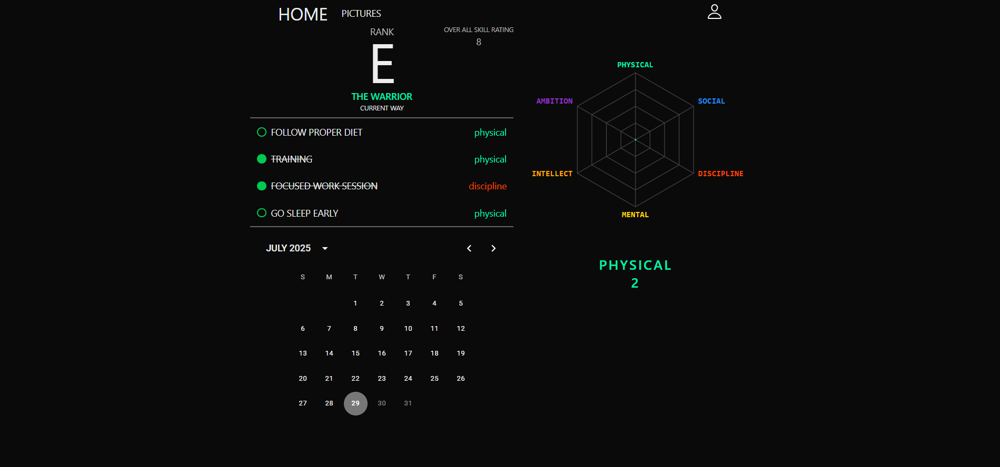
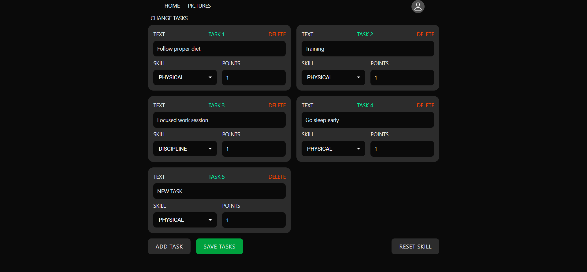

# Self Task

A goal-oriented productivity app where you set daily tasks and track your progress over time. Built with **Next.js**, **Zustand**, and **Firebase**, and supports **PWA** for mobile and desktop use.

📍 **Live Demo**: [https://self-task.vercel.app/auth](https://self-task.vercel.app/auth)

## ✨ Features

- ✅ Set and complete daily tasks
- 📈 Stats that improve as you stay consistent
- 🔐 Firebase authentication
- ⚡ Instant state management with Zustand
- 📱 PWA support — install the app on your phone or desktop
- ⚙️ Settings page with customizable preferences
- 🎨 Clean and responsive UI

## 🛠 Technologies Used

- **Next.js** — React framework for frontend & SSR
- **Zustand** — lightweight and fast state management
- **Firebase** — auth & cloud storage
- **PWA** — installable and offline-friendly

## 🚀 Getting Started

```bash
git clone https://github.com/your-username/self-task.git
cd self-task
npm install
npm run build
npm start
```

## 📸 Screenshots

### Home Page



### Settings Page

